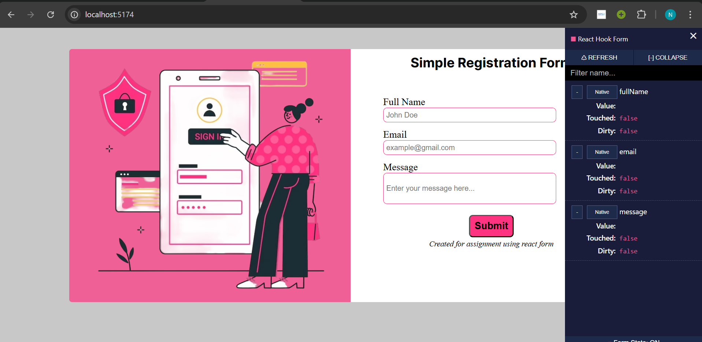
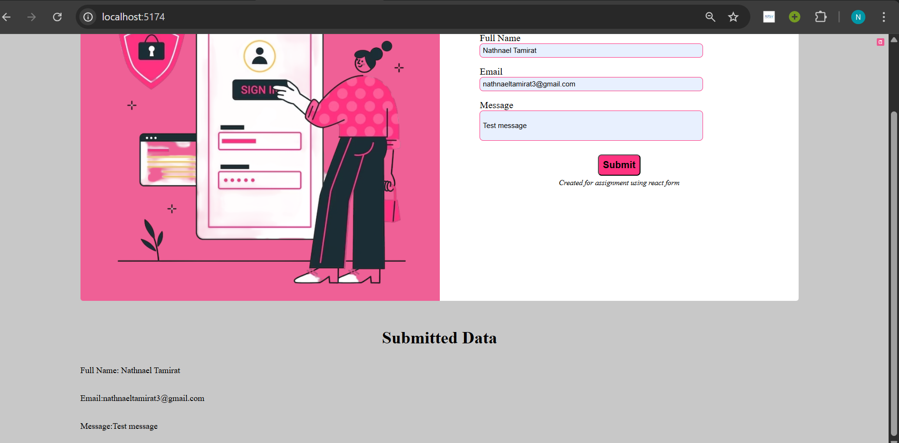

# Form Validation App

A simple and interactive Form submission built with React HTML, CSS, and Typescript. It allows users to submit form using react-hook form validation and used react dev tools hook form.

---

##  Features

- Submitting Task
- Email validation: required - format usage
- Full Name validation: required
- message validation: required
- Responsive and clean design


---

##  Tech Stack

- **HTML** – Structure
- **CSS** – Styling
- **Typescript** – Logic & Interactivity
- **React** - Framework
- **Figma** – UI mockup (included in `/mockup`)


---

##  Getting Started

### 1. Clone the repository

```bash
git clone https://github.com/nathnaeltamirat/a2sv-web.git
cd simple-form(task5)
```

### 2. Install dependencies
```bash
npm install
```

### 3. Start the development server
```bash
npm run dev
```
## Project Structure
```bash
task-manager-v3(react)/
├── node_modules/
├── public/
├── src/
│   ├── assets/
│   ├── components/
│   ├── images/
│   ├── mockup/
│   ├── public/
│   ├── App.tsx
│   ├── index.css
│   ├── main.tsx
│   └── vite-env.d.ts
├── .gitignore
├── eslint.config.js
├── index.html
├── package-lock.json
└── package.json

```


## Preview

###  Home Page - validation

###  Home Page - submission



  

## Mockup
[Nathnael Tamirat figma design sharable link](https://www.figma.com/design/wRqmc7VLVD5Bc1cOyrmv06/Untitled?node-id=1-2&t=ZwnTrgORUhjuUrOT-1)
###  Home screen


## 👨‍💻 Author

- **Name**: Nathnael Tamirat  
- **GitHub**: [@nathnaeltamirat](https://github.com/yourusername)  
- **LinkedIn**: [linkedin.com/in/nathnael-tamirat/](https://www.linkedin.com/in/nathnael-tamirat/)  
- **Email**: nathnaeltamirat3@gmail.com

