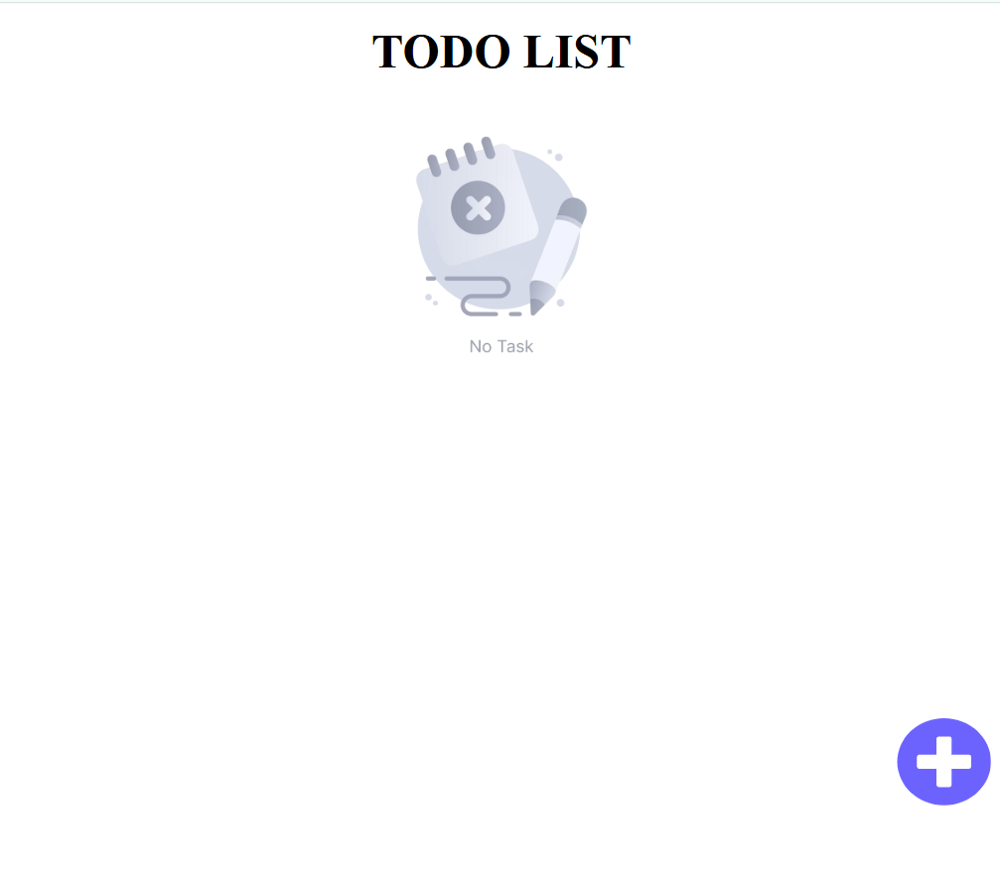
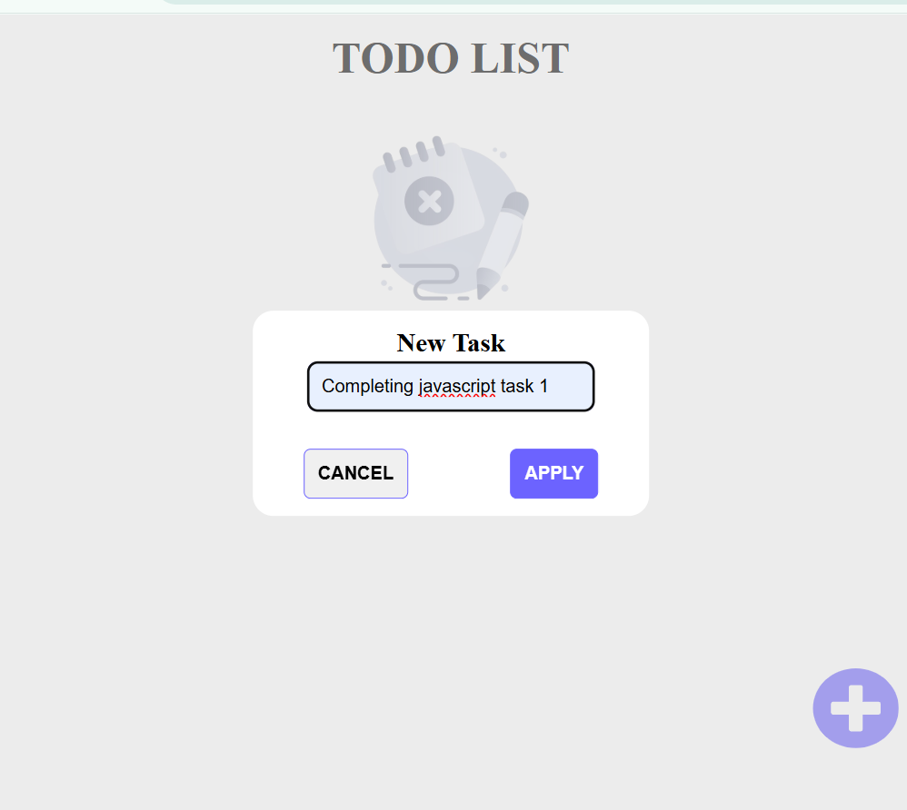
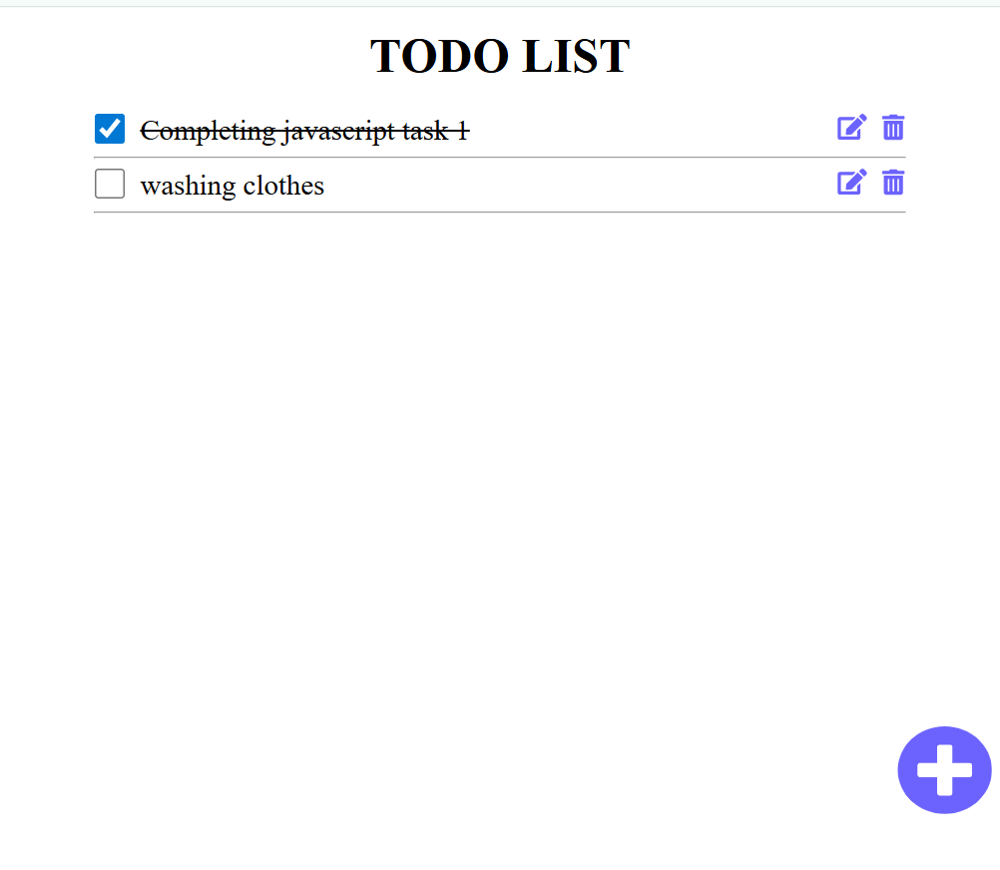
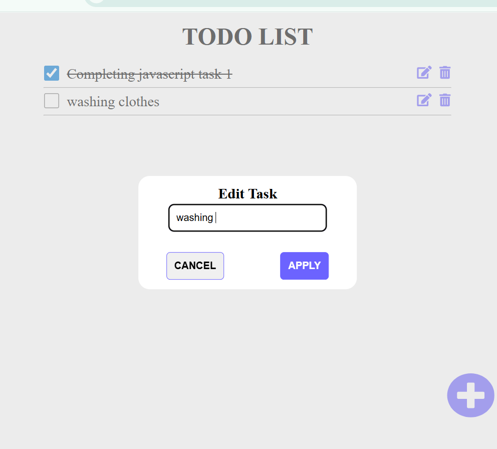
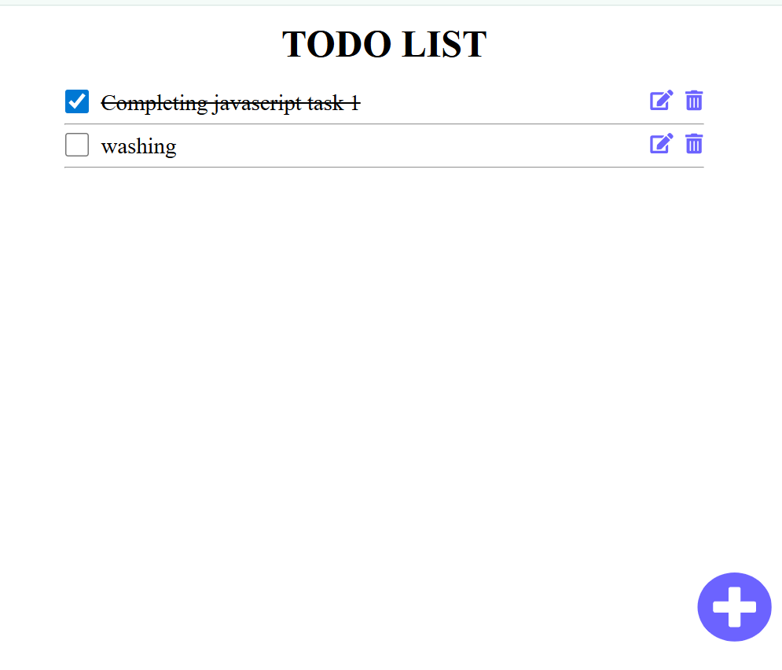
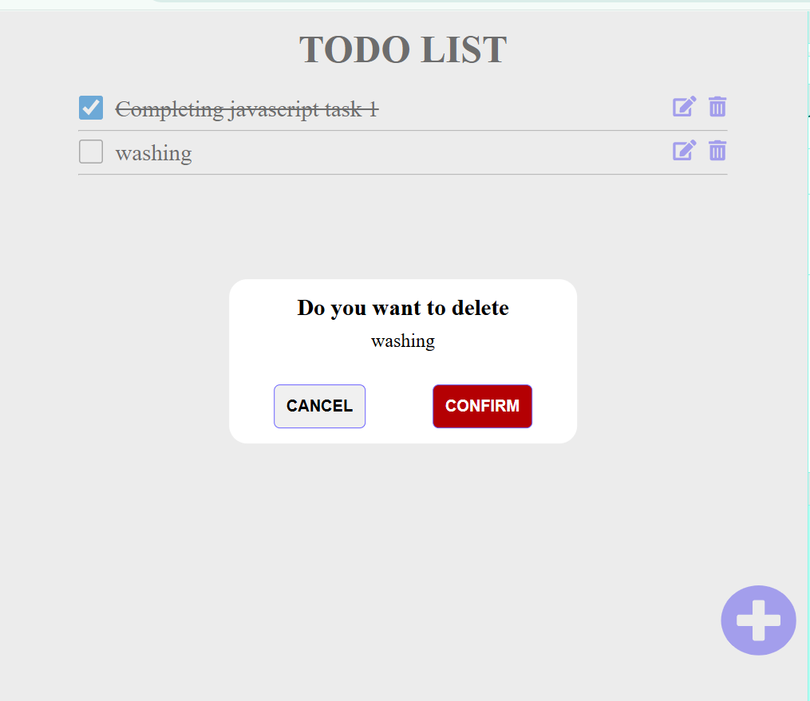
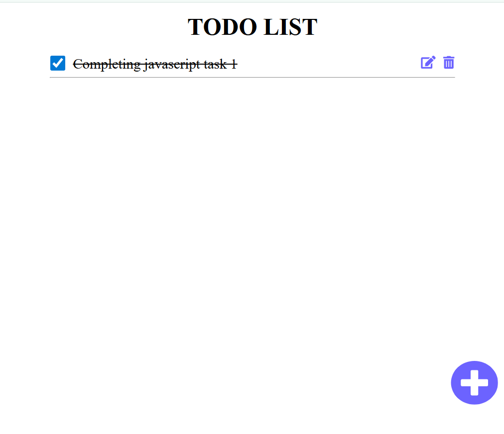
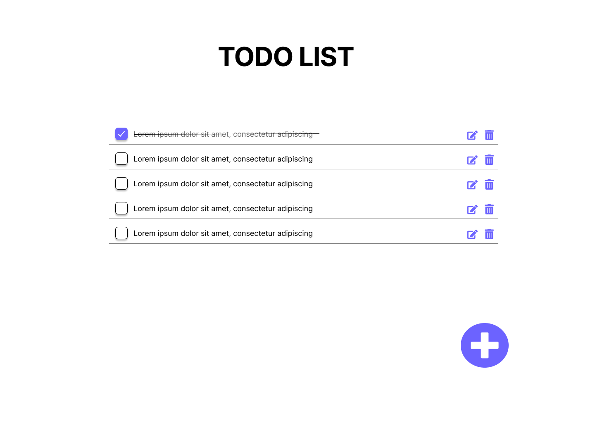
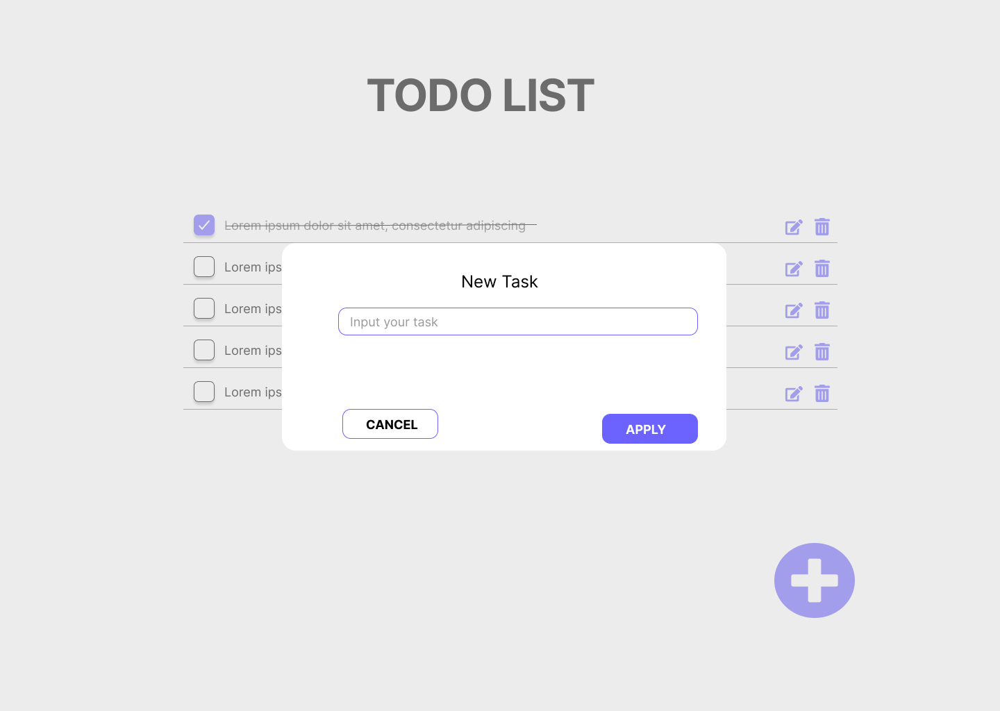
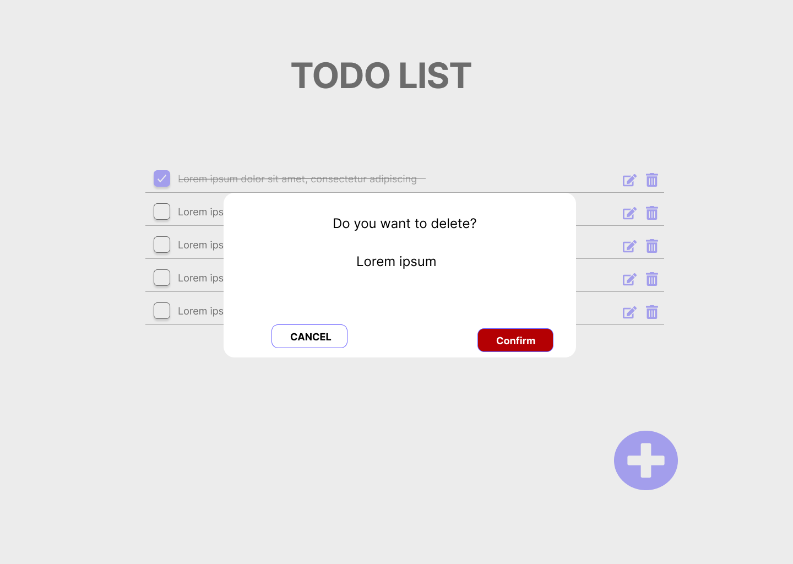

# Task Manager App

A simple and interactive task manager built with HTML, CSS, and JavaScript. It allows users to add, edit, complete, and delete tasks with a modern popup UI.

---

##  Features

- Add new tasks 
- Edit existing tasks via popup
- Mark tasks as complete with a checkbox
- Delete tasks with confirmation
- Responsive and clean design
- Visual feedback using overlays and text decorations

---

##  Tech Stack

- **HTML** – Structure
- **CSS** – Styling
- **JavaScript (Vanilla)** – Logic & Interactivity
- **Figma** – UI mockup (included in `/mockup`)


---

##  Getting Started

### 1. Clone the repository

```bash
git clone https://github.com/nathnaeltamirat/a2sv-web.git
cd task-manager-v1(vanillaJS)
```

### 2. Open in browser
```bash
open index.html
```

## Project Structure
```bash
task-manager-v1(vanilla-js)/
│
├── css/ # Stylesheets (style.css, etc.)
│
├── images/ # Images for no image, screenshots
│
├── js/ # JavaScript files (index.js)
│
├── mockup/ # Figma exports 
│
├── index.html # Main entry point
└── README.md # current_position
```

## Functions Overview

| Function Name        | Purpose                                      |
|----------------------|----------------------------------------------|
| `taskAdder()`        | Renders all tasks to the screen              |
| `editInput(index)`   | Opens edit popup for a specific task         |
| `deleteTask(index)`  | Confirms and deletes a task by index         |
| `completeMarker()`   | Adds line-through for completed tasks        |
| `taskAvailbilty()`   | Checks and shows "No Tasks" message          |
| `addTask()`          | Creates a popup for adding task              |

## Preview

###  Home Screen - No task

###  add-task screen

###  complete task Screen - 

###  edit_task screen

###  after edit Screen

###  Delete task Screen 

###  After Dlete Screen 


## Future Improvements

- [ ] LocalStorage support  
- [ ] Due date and priority tags  
- [ ] Filtering and search  
- [ ] Dark mode  

## Mockup
###  Home screen

###  Adding-ToDo screen

###  Deleting-ToDo screen

###  Editing-ToDo screen

## 👨‍💻 Author

- **Name**: Nathnael Tamirat  
- **GitHub**: [@nathnaeltamirat](https://github.com/yourusername)  
- **LinkedIn**: [linkedin.com/in/nathnael-tamirat/](https://www.linkedin.com/in/nathnael-tamirat/)  
- **Email**: nathnaeltamirat3@gmail.com

## UI Credit FOR inspiration
- **person**: [Dima Dzubenko](https://www.figma.com/@dimadzubenko)
- **inspired UI KIT**: [Figma file ui inspiration](https://www.figma.com/community/file/1287029163993360080)