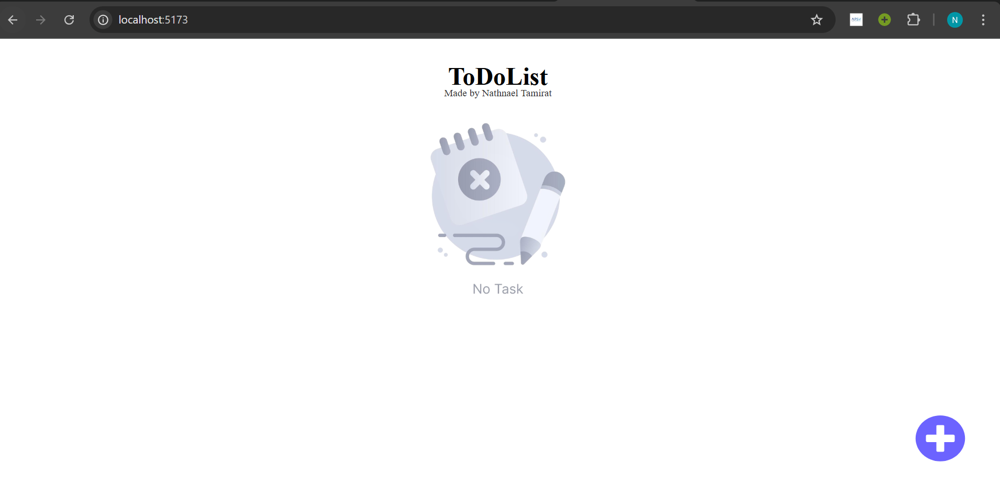
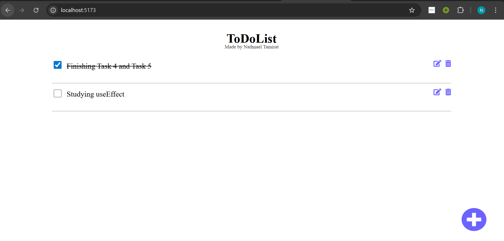
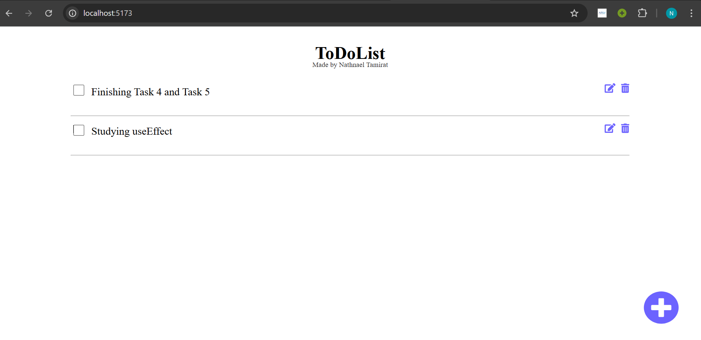
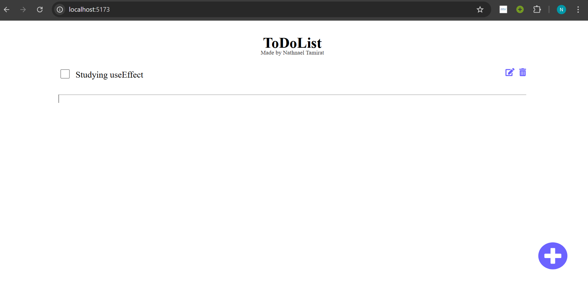
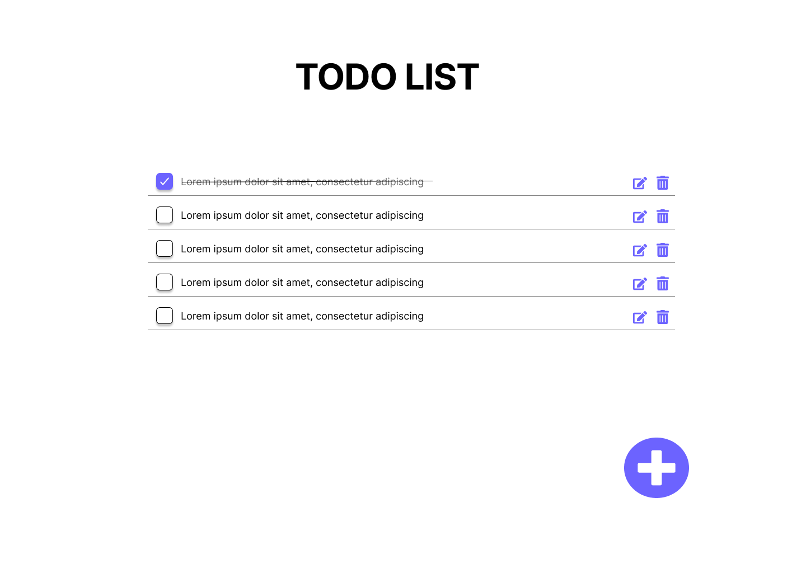
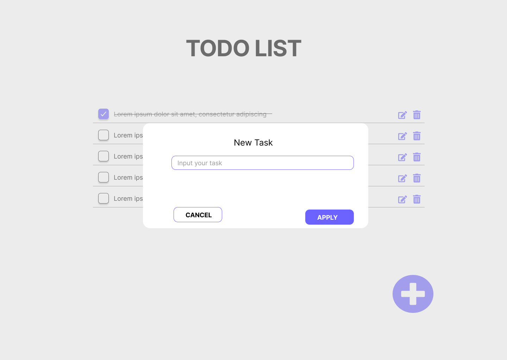
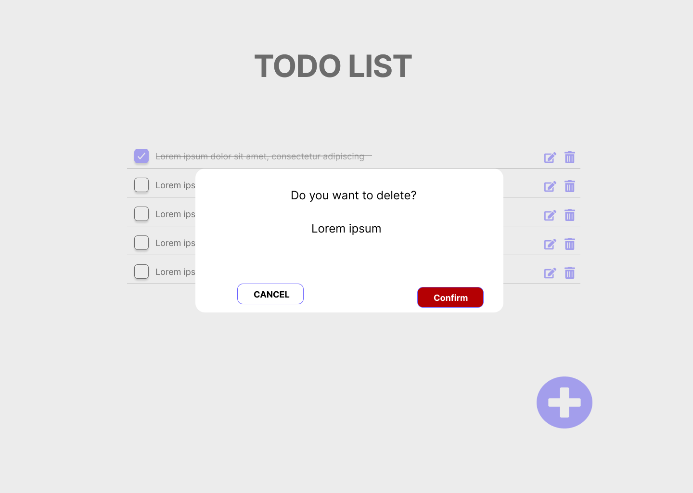

# Task Manager App

A simple and interactive task manager built with React HTML, CSS, and Typescript. It allows users to add, edit, complete,  with a modern popup UI and Delete.

---

##  Features

- Add new tasks 
- Edit existing tasks via popup
- Mark tasks as complete with a checkbox
- Delete tasks with confirmation
- Responsive and clean design
- Visual feedback using overlays and text decorations

---

##  Tech Stack

- **HTML** – Structure
- **CSS** – Styling
- **Typescript** – Logic & Interactivity
- **React** - Framework
- **Figma** – UI mockup (included in `/mockup`)


---

##  Getting Started

### 1. Clone the repository

```bash
git clone https://github.com/nathnaeltamirat/a2sv-web.git
cd task-manager-v3(react)
```

### 2. Install dependencies
```bash
npm install
```

### 3. Start the development server
```bash
npm run dev
```
## Project Structure
```bash
task-manager-v3(react)/
├── node_modules/
├── public/
├── src/
│   ├── assets/
│   ├── components/
│   │   ├── Adder/
│   │   ├── Edit/
│   │   ├── Header/
│   │   ├── PopupAdder/
│   │   └── Task/
│   ├── images/
│   ├── mockup/
│   ├── public/
│   ├── App.css
│   ├── App.tsx
│   ├── index.css
│   ├── main.tsx
│   └── vite-env.d.ts
├── .gitignore
├── eslint.config.js
├── index.html
├── package-lock.json
└── package.json

```


## Preview

###  Home Screen - No task

###  add-task screen

###  complete task Screen - 

###  edit_task screen

###  after edit Screen

###  Delete task Screen 



## Future Improvements

- [ ] LocalStorage support  
- [ ] Due date and priority tags  
- [ ] Filtering and search  
- [ ] Dark mode  

## Mockup
[Nathnael Tamirat figma design sharable link](https://www.figma.com/design/WAKCvPFRpOJga6ZaTJ59VU/ToDo-Mockup?node-id=0-1&m=dev)
###  Home screen

###  Adding-ToDo screen

###  Deleting-ToDo screen

###  Editing-ToDo screen

## 👨‍💻 Author

- **Name**: Nathnael Tamirat  
- **GitHub**: [@nathnaeltamirat](https://github.com/yourusername)  
- **LinkedIn**: [linkedin.com/in/nathnael-tamirat/](https://www.linkedin.com/in/nathnael-tamirat/)  
- **Email**: nathnaeltamirat3@gmail.com

## UI Credit FOR inspiration
- **person**: [Dima Dzubenko](https://www.figma.com/@dimadzubenko)
- **inspired UI KIT**: [Figma file ui inspiration](https://www.figma.com/community/file/1287029163993360080)